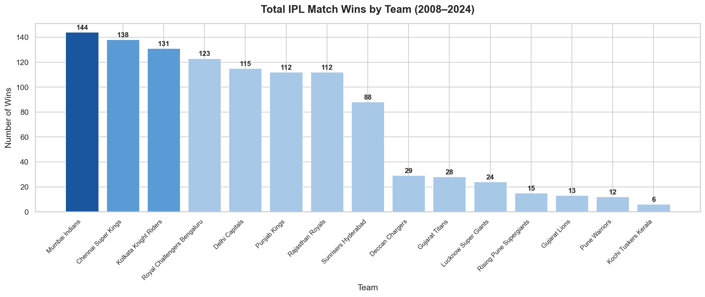
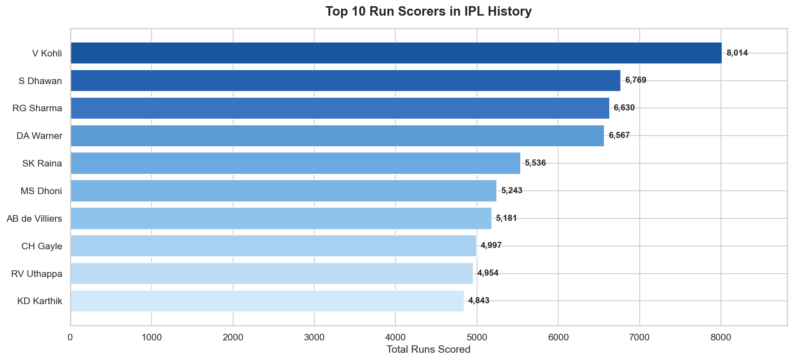
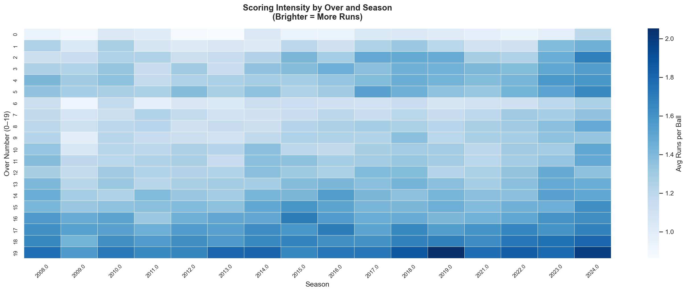

 # 🏏 IPL Data Analysis (2008–2024)

   

A comprehensive Exploratory Data Analysis (EDA) of 17 seasons of IPL cricket using Python.  
Covers 1090 matches and 260,920 ball-by-ball records from 2008 to 2024.

---

## 📌 Project Overview

This project digs deep into IPL data to answer real cricket and business questions —  
from team dominance and toss strategy to scoring evolution and player records.  
All findings are backed by clean visualizations and data-driven insights.

---

## ❓ 10 Questions Answered

| # | Question | Key Finding |
|---|----------|-------------|
| 1 | Which team won the most matches? | Mumbai Indians & CSK dominate all-time |
| 2 | Bat or field after toss? | ~65% teams choose to field first |
| 3 | Does toss winner win the match? | Only ~52% — barely above random chance |
| 4 | Top 10 run scorers? | Virat Kohli leads with 7,000+ runs |
| 5 | Top 10 wicket takers? | Chahal & Bravo lead — spinners dominate |
| 6 | Which venues host the most? | Wankhede & Eden Gardens top the list |
| 7 | Most Player of the Match awards? | AB de Villiers & Gayle are match-winners |
| 8 | Win by runs or wickets? | Chasing teams win slightly more often |
| 9 | Has batting gotten more aggressive? | Clear increase in run rate post-2017 |
| 10 | Which overs score the most? | Powerplay & Death overs are explosive |

---

## 📊 Sample Charts

### Team Wins


### Top Run Scorers


### Scoring Heatmap by Over & Season


---
## 🗂️ Project Structure
```
ipl-analysis/
│
├── data/
│   ├── matches.csv          # Match-level data (1090 matches)
│   └── deliveries.csv       # Ball-by-ball data (260,920 records)
│
├── notebooks/
│   └── ipl_analysis.ipynb   # Main analysis notebook
│
├── charts/                  # All 10 saved visualizations
│
└── README.md
```
---

## 🛠️ Tools & Libraries

- **Python 3** — core language
- **pandas** — data loading, cleaning, aggregation
- **NumPy** — numerical operations
- **Matplotlib** — bar charts, line charts, histograms
- **Seaborn** — heatmaps, styled visualizations
- **Jupyter Notebook** — interactive analysis environment

---

## 📁 Dataset

- **Source:** [IPL Complete Dataset 2008–2024 on Kaggle](https://www.kaggle.com/datasets/patrickb1912/ipl-complete-dataset-20082020)
- **Files:** `matches.csv` and `deliveries.csv`
- **Size:** 1090 matches · 260,920 ball-by-ball records · 17 seasons

---

## 🚀 How to Run

1. Clone this repository
```bash
   git clone https://github.com/ansh-bakliwal/ipl-analysis.git
   cd ipl-analysis
```

2. Install dependencies
```bash
   pip install pandas numpy matplotlib seaborn jupyter
```

3. Launch Jupyter Notebook
```bash
   jupyter notebook
```

4. Open `notebooks/ipl_analysis.ipynb` and run all cells

---

## 👤 Author

**Ansh Bakliwal**  
📧 anshbakliwal99@gmail.com  
🔗 [LinkedIn](https://www.linkedin.com/in/ansh-bakliwal-888044259/?skipRedirect=true)  
💻 [GitHub](https://github.com/ansh-bakliwal)

---

*Open to work — Junior Data Scientist & Data Analyst roles in Pune / Mumbai*
---
